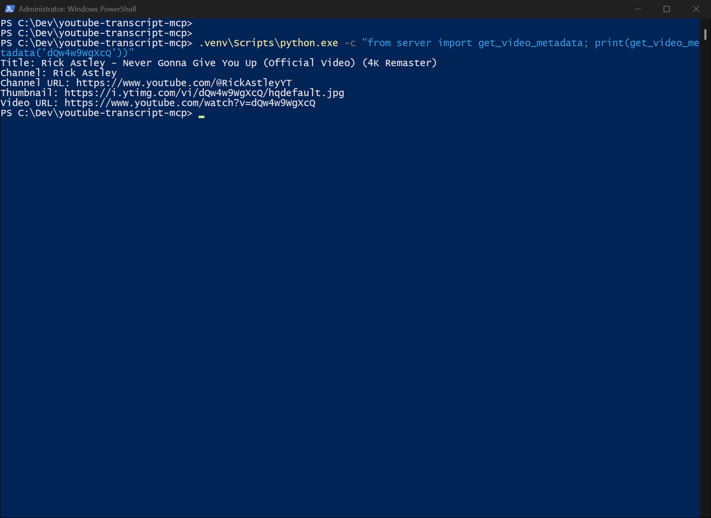

# youtube-transcript-mcp

MCP server that lets coding agents read, search and chapter-summarize YouTube transcripts. No API key needed.

[](LICENSE)
[](https://github.com/luigimasango-dev/youtube-transcript-mcp/actions/workflows/ci.yml)
[](https://www.python.org/downloads/)



## Quick start

Requires Python 3.11+ and [uv](https://docs.astral.sh/uv/). Tested 2026-09-11
from a fresh clone on Windows 11 (POSIX same, minus `py`):

```powershell
git clone https://github.com/luigimasango-dev/youtube-transcript-mcp.git
cd youtube-transcript-mcp
uv sync
uv run server.py
```

It sits waiting for MCP stdio input, so it will appear to do nothing until a
client connects. That is normal. Ctrl+C to exit.

Register it with an MCP client (Claude CLI example):

```
claude mcp add youtube-transcript -- uv --directory C:\Dev\youtube-transcript-mcp run server.py
```

Or in JSON config:

```json
{
  "mcpServers": {
    "youtube-transcript": {
      "command": "uv",
      "args": ["--directory", "C:\\Dev\\youtube-transcript-mcp", "run", "server.py"]
    }
  }
}
```

## How it works

This started as a small tool for my own use. I kept hitting conversations
that contained a YouTube link and needed to know what the video actually
said, and re-pasting transcripts around was wasting time. It became a
reusable server so that anything running on the Model Context Protocol
could just ask.

Captions come through YouTube's public endpoints; metadata comes through
YouTube's no-auth oEmbed endpoint. No API key, no Google account, nothing
to sign up for.

## Tools

| Tool | Purpose | Key args |
|---|---|---|
| `get_transcript` | Full transcript as plain text. Accepts watch, youtu.be, embed, shorts, live URLs or a bare 11-char video ID | `video_url_or_id`, `languages=["en"]`, `include_timestamps=False` |
| `get_video_metadata` | Title, channel name, channel URL and thumbnail via oEmbed (no upload date or description — those need a Data API key) | `video_url_or_id` |
| `search_transcript` | Segments matching a keyword/phrase, case-insensitive, each with a `[mm:ss]` timestamp | `video_url_or_id`, `query`, `languages=["en"]` |
| `summarize_chapters` | Splits the transcript into rough time-blocked chunks at natural pauses for section-by-section summarising. A heuristic, not YouTube's real chapter data | `video_url_or_id`, `gap_seconds=4.0`, `min_chunk_seconds=45.0`, `languages=["en"]` |

All tools return a plain string, including errors (for example "Error:
captions are disabled for this video"). No exceptions surface to the calling
agent, and no stack traces leak out.

## Limitations

- Only videos with captions (auto-generated or manual) work. Private videos,
  caption-less videos and live streams without captions return a clear error
  instead of a guess.
- No upload dates or full descriptions without a YouTube Data API key, by
  design.
- No caching. Two calls against the same video re-fetch both times. Fine for
  the tool's actual use; add caching if you ever need it at volume.
- The language list matters. `languages=["en"]` gets the English track when
  one exists. If a channel uploads in another language only, pass that code.

## Development

```powershell
uv sync
uv run --with pytest python -m pytest tests/ -v
```

The suite launches the real server over stdio, calls `tools/list`, and
asserts the four tool names are present. Pin `mcp>=1.28.1` but stay below
2.0 — mcp 2.x renamed `mcp.server.fastmcp` and the import breaks at server
start.

## License

MIT. See [LICENSE](LICENSE).
